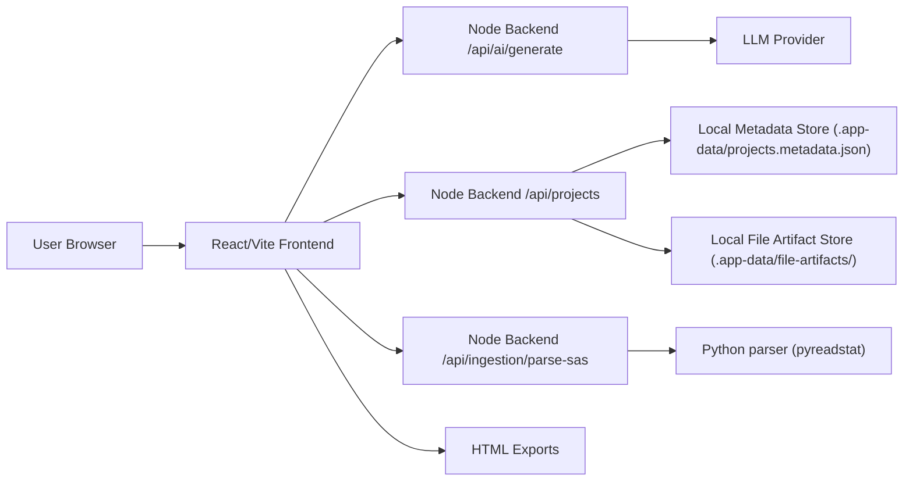
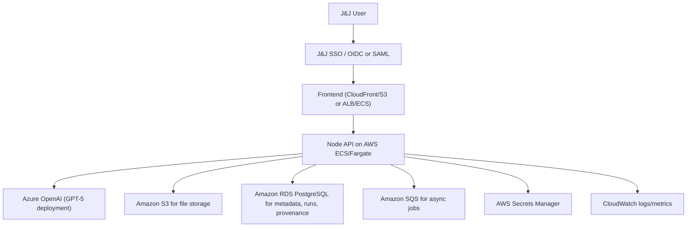

# Evidence CoPilot

Evidence CoPilot is a clinical and real-world evidence analytics workspace for:
- data ingestion and QC
- AI-assisted mapping and standardization
- exploratory and controlled statistical analysis
- protocol/SAP-assisted analysis planning
- linked multi-dataset analysis
- provenance and exportable reports

This repository contains the current prototype application and the minimum backend required to run AI features securely through a server-side proxy.

The next architecture step in this repository is a React + TypeScript frontend paired with a FastAPI analysis backend. The migration plan and backend scaffold now live in:

- `docs/react-fastapi-development-plan.md`
- `backend/`

## What This Repository Includes

- React + Vite frontend
- Integrated Node server for local development and simple deployment
- Server-side AI proxy endpoint at `/api/ai/generate`
- Server-side project persistence endpoint at `/api/projects`
- Server-side SAS dataset parsing endpoint at `/api/ingestion/parse-sas`
- Deterministic statistical execution engine in the app
- Local disk-backed project persistence for POC use
- Evidence CoPilot branding and report export

## Current Architecture



Current implementation notes:
- The frontend calls the backend for AI interactions.
- The frontend also calls the backend for project persistence.
- The backend currently uses Google Gemini in `server/index.js`.
- SAS transport files (`.xpt`) and SAS datasets (`.sas7bdat`) are parsed server-side through Python `pyreadstat`.
- Deterministic statistics are executed locally in app logic, not by the model.
- Project metadata is currently stored on local disk through the backend metadata store.
- File payloads are currently stored separately on local disk through the backend artifact store.
- Legacy browser IndexedDB/localStorage state is migrated forward on first load when available.

## Working Status

### Fully working in this repository

- local development and production-style local run
- Evidence CoPilot frontend and integrated Node backend
- backend AI proxy pattern
- backend-backed local project persistence
- split local metadata and file-artifact persistence
- ingestion, QC, mapping, Autopilot, Statistical Analysis, AI Chat
- `.xpt` and `.sas7bdat` ingestion when the local Python parser dependency is installed
- deterministic statistical execution
- HTML report export
- local-first prototype testing with no cloud dependency

### Partially implemented / enterprise-ready seams only

- J&J enterprise authentication and authorization
- AWS-managed storage and metadata services
- Azure OpenAI GPT-5 provider implementation
- async worker architecture for heavy background jobs
- immutable enterprise audit trail and governed retention model
- multi-user shared persistence and access enforcement

### What “partially implemented” means here

These areas are prepared architecturally but not fully wired to real enterprise services yet:
- the app already uses backend endpoints rather than browser-only storage
- project metadata and uploaded file payloads are already separated behind the backend boundary
- AI calls already flow through a backend boundary
- access control is centralized and can be reconnected to SSO later
- storage and provider swaps can happen server-side without redesigning the frontend

### Not implemented yet

- real S3-backed file and artifact persistence
- real RDS/PostgreSQL metadata persistence
- shared multi-user project ownership and collaboration model
- server-side authorization enforcement
- async worker/queue execution for heavy jobs
- immutable audit persistence and signature workflow
- enterprise monitoring, alerting, backup, and recovery
- environment promotion and infrastructure-as-code

## Enterprise Integration Status Matrix

| Area | Current state in repo | Enterprise readiness | What still must be done |
|---|---|---:|---|
| Frontend application | Working | Partial | Host through approved enterprise path and remove remaining external CDN dependency if policy requires it |
| Backend API boundary | Working | Partial | Split integrated server into dedicated API/worker services and harden auth, validation, and rate controls |
| AI provider boundary | Working | Partial | Replace provider implementation with Azure OpenAI GPT-5 backend and task-specific model routing |
| Project persistence | Working locally | Partial | Move metadata to RDS/PostgreSQL and files/artifacts to S3 |
| SAS/ADaM binary ingestion | Working locally | Partial | Containerize Python parser/runtime and decide whether to keep `pyreadstat` service-side or replace with a managed parsing service |
| Authentication | POC open access | No | Integrate J&J sign-in and validate identity on every backend request |
| Authorization | Frontend-only POC policy | No | Enforce claim/group-based authorization in backend APIs |
| Analysis execution | Working | Partial | Add async jobs, central run manifests, and governed rerun semantics |
| Audit/provenance | Basic app provenance | Partial | Store immutable audit trail, approval records, hashes, and signatures centrally |
| Multi-user operation | Not implemented | No | Add shared persistence, ownership, permissioning, and concurrency handling |
| Deployment/operations | Local only | No | Add CI/CD, observability, secrets, network controls, backup, and disaster recovery |

## Repository Structure

- `/components` UI modules
- `/services/geminiService.ts` frontend service layer for AI and deterministic workflows
- `/server/index.js` integrated backend server and AI proxy
- `/server/projectStore.js` local disk-backed metadata and artifact persistence adapter
- `/utils/statisticsEngine.ts` deterministic analysis execution
- `/utils/projectStorage.ts` frontend project persistence client and legacy migration helpers
- `/public` static assets including the Evidence CoPilot logo

## Local Reproduction

### Prerequisites

- Node.js 22.x recommended
- npm 10+
- Python 3.12+ recommended for SAS dataset ingestion (`.xpt`, `.sas7bdat`)

### Install

```bash
npm install
```

Install the local Python parser dependencies if you want native `.xpt` or `.sas7bdat` ingestion:

```bash
python3 -m venv .venv
.venv/bin/python -m pip install -r requirements.txt
```

The backend automatically uses `.venv/bin/python3` if it exists. You can override it with:

```bash
ECP_PYTHON_BIN=/path/to/python3
```

### Local environment

Create `.env.local` in the repository root.

For the current prototype backend:

```bash
GEMINI_API_KEY=your_key_here
PORT=3000
```

For the new FastAPI analysis backend during migration:

```bash
VITE_FASTAPI_BASE_URL=http://localhost:8000/api/v1
ECP_ENV=development
```

### Run locally

```bash
npm run api:setup
npm run dev
```

`npm run dev` now starts the Node/Vite app shell and the FastAPI backend together for local development.

If you only want the analysis API:

```bash
npm run api:dev
```

If you explicitly want FastAPI autoreload and your environment allows filesystem watchers:

```bash
npm run api:watch
```

Open:

```text
http://localhost:3000
```

FastAPI analysis healthcheck:

```text
http://localhost:8000/api/v1/health
```

### Production-style local run

```bash
npm run build
npm run start
```

## What Is Reproducible From Git

A colleague can reproduce:
- the application code
- UI behavior
- AI proxy pattern
- backend-backed local persistence behavior
- split metadata/file payload persistence behavior
- `.xpt` / `.sas7bdat` ingestion if they also install the Python requirements
- deterministic analytics behavior
- export/report generation

A colleague cannot reproduce automatically:
- your local `.app-data/projects.metadata.json`
- your local `.app-data/file-artifacts/`
- uploaded source files
- local `.env.local`
- your saved chat history and runs

For shared testing, import the same datasets and recreate the same environment variables. If you want to share the exact local project state, you must also transfer the local backend persistence files under `.app-data/`.

## POC vs Enterprise

### Current POC assumptions

The current codebase is suitable for pilot testing, not regulated production.

POC characteristics:
- everyone has full access in the app
- auth is intentionally simplified
- project data is stored in a local backend file store
- SAS binary ingestion depends on a local Python runtime plus `pyreadstat`
- some frontend dependencies are loaded from CDN in `index.html`
- the backend is a lightweight integrated Node server

What is already better than the earlier prototype:
- project state is no longer browser-only
- the frontend already depends on backend APIs for both AI and project persistence
- project metadata and uploaded file payloads are no longer coupled into one monolithic browser or server blob
- this makes the enterprise migration path cleaner

### Enterprise target state

For enterprise deployment, the recommended target architecture is:



## Enterprise Deployment Recommendation

### Frontend

Recommended options:
- `S3 + CloudFront` if serving a static build only
- `AWS ECS/Fargate + ALB` if you want the frontend and backend served together from one service

Recommendation for this repo:
- keep the frontend as a static React build
- move the current integrated backend into a dedicated API service
- replace the current local disk store with managed enterprise persistence

### Backend

Recommended runtime:
- Node.js service on AWS ECS/Fargate
- private subnets for compute where possible
- public ingress only through ALB or approved API gateway pattern

Move the following server-side for enterprise use:
- AI calls
- file parsing where PHI/PII sensitivity requires central control
- project persistence
- report generation if you need governed exports
- provenance/audit persistence

Recommended backend service split:
- `frontend` static build delivery
- `api-service` for synchronous user-facing APIs
- `worker-service` for heavy ingestion, transformation, Autopilot, and export jobs
- optional `scheduler` for maintenance and recurring tasks

Recommended API domains:
- `/api/auth/*`
- `/api/projects/*`
- `/api/files/*`
- `/api/analysis/*`
- `/api/ai/*`
- `/api/provenance/*`
- `/api/exports/*`

### Data persistence

Replace the current local metadata and artifact stores with managed backend persistence:
- `S3` for uploaded raw files, standardized files, generated exports, and other binary/artifact payloads
- `RDS PostgreSQL` for:
  - projects
  - file metadata
  - mapping specs
  - analysis runs
  - review decisions
  - provenance/audit logs
- optional `Redis/ElastiCache` if you later need short-lived job/session caching

Recommended storage split:
- `raw-data bucket` for source uploads
- `derived-data bucket` for standardized datasets, linked workspaces, and exports
- `metadata database` for projects, files, runs, review decisions, and provenance
- `optional cache` only for transient execution state, never as system of record

### Async processing

Use async job execution for heavier operations:
- workbook import
- multi-file linking
- Autopilot packs
- large exports
- protocol/SAP extraction on large documents

Recommended pattern:
- API submits job
- `SQS` queue stores work
- worker service processes job
- status stored in `RDS`
- artifacts stored in `S3`

Recommended async candidates:
- workbook sheet expansion and merge planning
- QC on large datasets
- AI mapping suggestion generation
- linked workspace creation
- Autopilot packs
- protocol/SAP extraction on large documents
- export generation

## Azure OpenAI With GPT-5

### Why this is the right integration boundary

The frontend already talks to a single backend endpoint:
- `/api/ai/generate`

That means changing LLM provider should be done in the backend only.
The frontend contract can remain stable.

### Recommended provider strategy

Refactor the backend into an AI provider abstraction:
- `geminiProvider`
- `azureOpenAIProvider`

The frontend should continue calling:
- `/api/ai/generate`

This is the cleanest enterprise pattern because:
- no model credentials reach the browser
- provider changes do not require frontend rewrites
- provider choice can be environment-driven

Recommended provider contract:
- `generateText`
- `generateStructuredJson`
- `extractPlanItems`
- `generateClinicalCommentary`
- `healthcheck`

Recommended runtime policy:
- choose provider by environment/config only
- keep prompt templates versioned server-side
- persist provider, deployment, and prompt version for every AI-assisted action

### Azure OpenAI guidance

For Azure OpenAI, use GPT-5 through the Responses API from the backend.

Based on current Microsoft documentation:
- Azure OpenAI Responses API is the recommended path for latest features
- not every model is available in every Azure region
- the `model` field must match your Azure deployment name
- Microsoft Entra ID is supported and preferred for enterprise auth to the Azure resource

### Recommended Azure environment variables

```bash
AI_PROVIDER=azure-openai
OPENAI_BASE_URL=https://YOUR-RESOURCE-NAME.openai.azure.com/openai/v1/
OPENAI_API_KEY=your_azure_openai_key
AZURE_OPENAI_DEPLOYMENT=gpt-5
AZURE_OPENAI_USE_ENTRA=false
PORT=3000
```

Preferred enterprise auth variant:
- avoid long-lived API keys where possible
- use Microsoft Entra ID / managed identity from AWS workload if your enterprise networking and identity model allows it

### Recommended backend change for Azure OpenAI

Current file to replace/refactor:
- `server/index.js`

Current provider-specific dependency:
- `@google/genai`

Recommended enterprise dependency:

```bash
npm install openai
```

Recommended backend pattern:

```ts
import OpenAI from 'openai';

const client = new OpenAI({
  baseURL: process.env.OPENAI_BASE_URL,
  apiKey: process.env.OPENAI_API_KEY,
});

const response = await client.responses.create({
  model: process.env.AZURE_OPENAI_DEPLOYMENT,
  input: prompt,
});
```

Important implementation note:
- in Azure OpenAI, `model` should be the Azure deployment name, not just a generic model family label

### Recommended model choices

For this app, a sensible enterprise split is:
- `gpt-5` for protocol/SAP extraction, planning, and higher-value commentary
- `gpt-5-mini` for lower-cost chat/QC/mapping suggestion tasks if quality is acceptable

Use one provider config per task class rather than one model for everything.

## J&J Authorization / Enterprise Sign-In

Current state:
- role-based access is intentionally disabled for POC testing
- the app currently shows `POC Access`
- access logic is centralized in `utils/accessControl.ts`

Recommended enterprise state:
- authenticate users with J&J corporate identity
- authorize on the backend using enterprise claims/groups
- stop treating frontend access flags as authoritative

Recommended auth model:
- J&J IdP via `OIDC` or `SAML`
- backend validates identity/session or JWT claims
- frontend receives only the user profile and permitted capabilities

Recommended implementation pattern:
1. Add enterprise login at the edge or in the backend
2. Pass validated user identity to the app
3. Re-enable access control using claims/groups from the identity provider
4. Enforce permissions in backend APIs, not just in frontend navigation

Recommended authorization layers:
- workspace access
- file access
- analysis execution
- export/share permission
- governance/admin actions

What still must be implemented for auth:
- login initiation and callback flow
- secure session or token validation middleware
- claim-to-capability mapping
- logout/session invalidation
- backend request guards
- audit attribution using enterprise identity rather than POC labels

Do not rely on:
- local role pickers
- browser-side authorization alone

## Security Requirements For Enterprise Use

Before enterprise rollout, the following should be treated as required:

1. Remove browser-only project persistence for governed data
2. Store files and runs on managed backend infrastructure
3. Keep all LLM credentials server-side only
4. Use Secrets Manager for secrets
5. Add immutable run manifests and artifact hashes
6. Add server-side audit logging
7. Restrict report exports by user identity and project entitlement
8. Replace CDN-loaded frontend dependencies with bundled or approved internal asset hosting
9. Add data retention and deletion policies
10. Classify outputs as exploratory vs confirmed in stored metadata

Additional enterprise security work:
- move all secrets to AWS Secrets Manager or approved equivalent
- enforce encryption at rest for S3 and RDS
- enforce TLS for all service-to-service traffic
- define PHI/PII handling controls for prompts, logs, exports, and artifacts
- add request validation, payload limits, and upload scanning if required by policy
- add dependency/container vulnerability scanning
- replace CDN-loaded runtime assets if external CDN use is not allowed

## Gaps To Close Before Enterprise Deployment

This repo is a strong prototype, but the following are still recommended before production:

- replace the local disk project store with S3 + RDS backed persistence
- move large-file processing and multi-file jobs fully server-side
- add durable audit trail in database
- add approval workflow for AI-assisted mapping and confirmatory runs
- add claim-based authorization enforced by backend
- remove or replace CDN dependencies in `index.html`
- add CI/CD, containerization, infrastructure-as-code, and environment promotion
- add structured health checks and observability dashboards

## Detailed Enterprise Work Breakdown

### Phase 1: Backend hardening while remaining local-first

Goal:
- keep the app runnable on a developer machine
- remove remaining prototype-only architectural bottlenecks

Work:
- split metadata and file artifacts, which is now implemented
- move analysis/export artifacts behind explicit backend abstractions
- add provider interfaces for AI, storage, auth, and job execution
- add structured API validation and typed error responses

Exit criteria:
- frontend depends on backend APIs for persistence and AI
- local storage implementation can be swapped without frontend redesign

### Phase 2: Enterprise service substitution

Goal:
- preserve app behavior while replacing local infrastructure with managed enterprise services

Work:
- local artifact store -> S3
- local metadata store -> RDS/PostgreSQL
- current AI provider -> Azure OpenAI GPT-5 backend
- open POC access -> J&J SSO + server-side authorization
- synchronous heavy tasks -> SQS + worker service

Exit criteria:
- app runs in AWS with managed persistence
- AI provider is environment-driven on the backend
- user identity and permissions are enforced on every backend request

### Phase 3: Governance and operationalization

Goal:
- make the platform supportable and credible for broader enterprise use

Work:
- immutable audit trail and approval workflow
- backup and disaster recovery
- observability dashboards and alerting
- environment promotion controls
- retention and deletion policy support

Exit criteria:
- system behavior, recovery, and audit expectations are documented and tested

## What Else Should Be Done Before Calling This Enterprise-Ready

At minimum:
1. Replace local artifact persistence with S3.
2. Replace local metadata persistence with RDS/PostgreSQL.
3. Implement J&J authentication and backend authorization.
4. Replace the current AI provider implementation with Azure OpenAI GPT-5 backend integration.
5. Add SQS-backed worker execution for heavy jobs.
6. Persist immutable audit records, execution manifests, and artifact hashes.
7. Add secrets management, environment separation, and IaC.
8. Add monitoring, alerting, backup, and disaster recovery.
9. Remove remaining runtime CDN dependency if enterprise policy requires internal hosting only.
10. Complete security, data handling, and validation review.

## Suggested AWS Deployment Topology

### Minimum viable enterprise topology

- CloudFront
- S3 for static frontend
- ALB
- ECS/Fargate service for Node API
- RDS PostgreSQL
- S3 document/file bucket
- Secrets Manager
- CloudWatch

### Scaled topology

- CloudFront
- WAF
- ALB
- ECS/Fargate API service
- ECS/Fargate worker service
- SQS
- RDS PostgreSQL
- S3 raw bucket
- S3 curated/standardized bucket
- KMS encryption
- Secrets Manager
- CloudWatch + alarms

## CI/CD Recommendation

At minimum:
- lint/test/build on pull request
- build immutable container image for backend
- build static frontend artifact
- deploy by environment: dev, test, prod
- separate Azure OpenAI resource/deployment config by environment

## Observability Recommendation

At minimum, emit and monitor:
- API request count and latency
- AI provider failures
- file ingestion failures
- QC pass/fail counts
- mapping approval counts
- Autopilot execution failures
- export generation failures
- user/session audit events

## Enterprise Rebuild Checklist

Use this checklist when recreating the app in J&J infrastructure:

- [ ] Clone repo
- [ ] Install dependencies
- [ ] Decide whether frontend and backend deploy together or separately
- [ ] Replace browser-only persistence with backend persistence
- [ ] Implement J&J SSO
- [ ] Enforce authorization on backend APIs
- [ ] Swap Gemini backend provider to Azure OpenAI provider
- [ ] Configure Azure GPT-5 deployment and region
- [ ] Store secrets in AWS Secrets Manager
- [ ] Move file storage to S3
- [ ] Move project/run metadata to RDS
- [ ] Add async processing for heavy jobs
- [ ] Add audit logging and immutable run manifests
- [ ] Remove or vendor CDN frontend dependencies
- [ ] Add environment-specific CI/CD and observability

## References

- OpenAI GPT-5 model docs: https://developers.openai.com/api/docs/models/gpt-5
- Azure OpenAI Responses API docs: https://learn.microsoft.com/en-us/azure/ai-foundry/openai/how-to/responses
- Azure OpenAI v1 API guidance: https://learn.microsoft.com/en-us/azure/ai-foundry/foundry-models/how-to/use-chat-completions

## Current Commands

```bash
npm install
npm run dev
npm run test
npm run build
npm run start
```

## Notes For the Next Engineering Team

The cleanest enterprise migration path is:
1. keep the frontend contract stable
2. keep persistence server-side, but swap the local disk adapter for S3/RDS
3. swap only the backend AI provider first
4. integrate enterprise auth second
5. harden audit/provenance third

That sequence preserves momentum and avoids rewriting the whole app at once.
