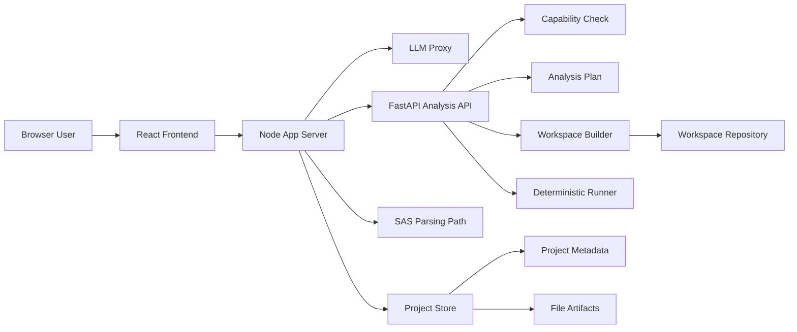
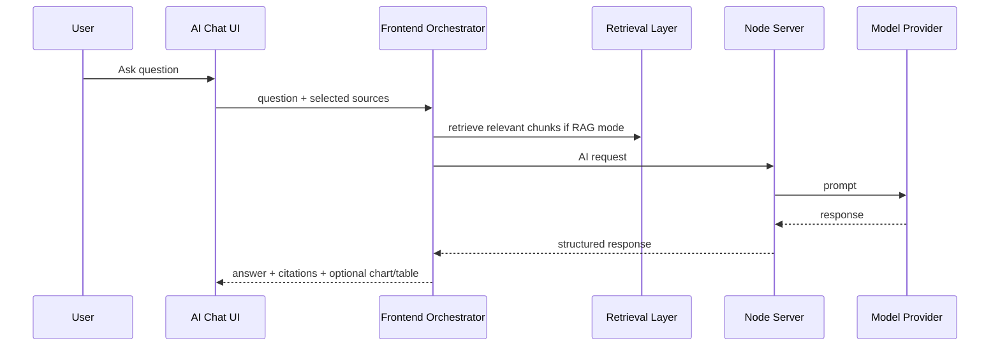
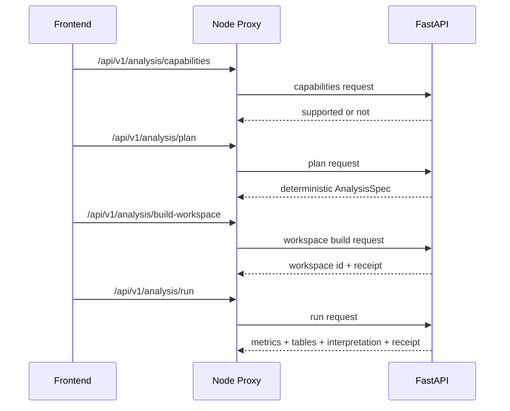
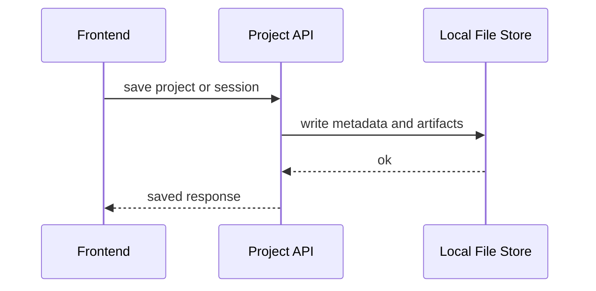
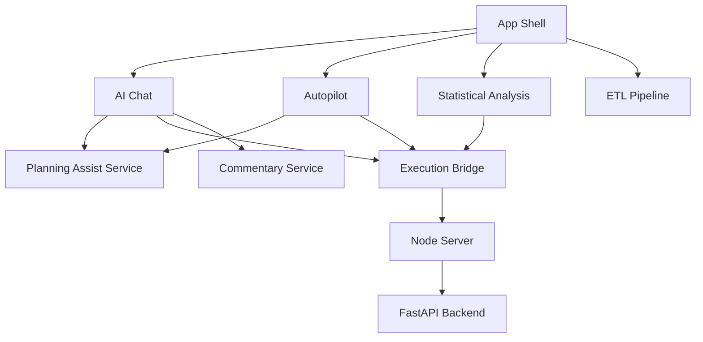
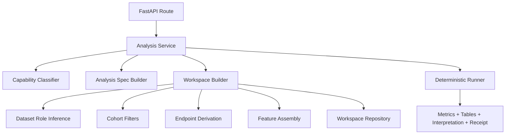

# Evidence CoPilot

Evidence CoPilot is a clinical analytics workspace for:
- ingesting raw clinical datasets and study documents
- running QC and mapping workflows
- standardizing data through ETL
- asking exploratory questions in AI Chat
- running guided workflows in Autopilot
- executing structured analyses in Statistical Analysis
- returning deterministic tables, metrics, charts, narrative interpretation, and exportable HTML reports

This repository is a hybrid application, not a pure LLM chatbot:
- `React + TypeScript` provides the product UI
- `Node` provides the local application shell, project persistence, SAS parsing entrypoints, and API proxying
- `FastAPI + Python` performs row-level workspace building and deterministic analysis execution

The most important design principle is:

> LLMs help interpret, plan, explain, and propose.  
> Deterministic code builds cohorts, derives endpoints, runs analyses, and produces auditable results.

## Table of Contents

- [What The Product Does](#what-the-product-does)
- [How A New User Should Think About The App](#how-a-new-user-should-think-about-the-app)
- [System Architecture](#system-architecture)
- [Request Lifecycles](#request-lifecycles)
- [Role Of The LLM](#role-of-the-llm)
- [Role Of Deterministic Analysis](#role-of-deterministic-analysis)
- [Data And Execution Schemas](#data-and-execution-schemas)
- [Frontend Architecture](#frontend-architecture)
- [Backend Architecture](#backend-architecture)
- [Feature Surface Overview](#feature-surface-overview)
- [Supported Analysis Families](#supported-analysis-families)
- [Repository Structure](#repository-structure)
- [Local Development](#local-development)
- [Testing And Validation](#testing-and-validation)
- [Current Limits](#current-limits)
- [Architecture Strengths](#architecture-strengths)

## What The Product Does

Evidence CoPilot is designed around a realistic clinical data workflow:

1. Upload source datasets and protocol-like documents.
2. Run QC to identify structural and content issues.
3. Generate or review mapping logic.
4. Standardize raw files through ETL.
5. Build linked workspaces or analysis-ready subsets.
6. Explore questions in AI Chat or run guided workflows in Autopilot.
7. Execute deterministic analyses for supported question types.
8. Return:
   - charts
   - tables
   - metrics
   - structured commentary
   - execution receipts
   - exportable HTML reports

This means the app is not just “chat over files.” It is a local clinical analytics workbench with an AI planning layer and a deterministic execution layer.

## How A New User Should Think About The App

The main surfaces have different jobs.

### `AI Insights Chat`
Use this when the user wants to:
- explore what the selected data can answer
- ask a question quickly
- get file recommendations
- compare a few ideas before committing

### `AI Autopilot`
Use this when the user wants to:
- run a guided workflow
- save a reusable run
- review saved analyses
- export a tracked analysis result

### `Statistical Analysis`
Use this when the user wants:
- tighter control over the final analysis
- explicit workbench-style execution
- plan review
- code review / execution review

### `ETL Pipeline`
Use this when the raw files are messy, inconsistent, or not analysis-ready.

The simplest user model is:
- `AI Chat` = explore and decide
- `Autopilot` = run and document
- `Statistical Analysis` = control and finalize
- `ETL` = prepare data so the other three work reliably

## System Architecture



### Why It Is Split This Way

- The frontend is best for interaction, workbench UX, charts, and session state.
- Node is the local app shell and persistence boundary.
- Python is the right execution environment for:
  - row-level derivation
  - cohort filtering
  - survival and regression workflows
  - statistical validation

## Request Lifecycles

### 1. General AI Question



### 2. Advanced Deterministic Analysis



### 3. Saved Run / Project Persistence



## Role Of The LLM

The LLM is used as an advisory and explanatory layer.

### LLM responsibilities

- explain what a dataset or workflow means
- answer general document and context questions
- support RAG-style retrieval
- suggest candidate questions to explore
- help propose file roles and predictor families
- generate planning-assist text
- generate narrative commentary
- explain partial answers and next steps

### LLM is not authoritative for:

- final cohort derivation
- endpoint derivation
- censoring logic
- model fitting
- hazard ratios, p-values, or inferential outputs
- final execution receipts

### Practical rule

If a result requires real analytical trust, the LLM should describe the result, not create it.

## Role Of Deterministic Analysis

Deterministic analysis is the part of the system that actually produces the numbers.

### Deterministic responsibilities

- capability checks
- plan building for supported question families
- role inference for selected datasets
- row-level workspace construction
- endpoint derivation
- cohort filtering
- covariate assembly
- model execution
- metrics, result tables, receipts
- question-match validation

### Why deterministic analysis matters

Without deterministic execution, an advanced clinical analysis UI will eventually return polished but untrustworthy answers. This app explicitly avoids that by separating:
- `planning and explanation`
- from `execution and evidence`

## Data And Execution Schemas

### Core app runtime schema



### Deterministic backend schema



### Project persistence schema

Projects are persisted locally by the Node layer.

Stored concepts:
- project metadata
- uploaded file artifacts
- saved statistical sessions
- saved Autopilot sessions
- provenance records

### Analysis session schema

The core persisted analytical object is `AnalysisSession` in [types.ts](/Users/mikhailnikonorov/Clinical-trial-insight/types.ts).

At a high level, a saved session contains:
- analysis name
- timestamp
- chart/table result
- deterministic metrics
- AI commentary
- execution code or summary
- parameters used to run the analysis
- Autopilot metadata when relevant

### Analysis API schema

The FastAPI backend uses typed request/response models in [backend/app/models/analysis.py](/Users/mikhailnikonorov/Clinical-trial-insight/backend/app/models/analysis.py).

Key contracts:
- `AnalysisCapabilityRequest` / `AnalysisCapabilityResponse`
- `AnalysisPlanRequest` / `AnalysisPlanResponse`
- `WorkspaceBuildRequest` / `WorkspaceBuildResponse`
- `AnalysisRunRequest` / `AnalysisRunResponse`
- `AnalysisSpec`
- `AnalysisExecutionReceipt`

### What `AnalysisSpec` represents

`AnalysisSpec` is the deterministic bridge between plain-language question and executable analysis.

It includes concepts such as:
- analysis family
- endpoint definition
- outcome variable
- time variable
- treatment variable
- covariates
- interaction terms
- cohort filters
- requested outputs

### What `AnalysisExecutionReceipt` represents

It is the audit-oriented description of what really ran:
- source datasets used
- workspace identifier
- derived fields
- endpoint label
- target definition
- cohort filters applied
- row and column shape
- analysis-family-specific variables

This receipt is what allows the UI to say:
- what dataset was really used
- what endpoint was really modeled
- whether the result was a strong match or only a partial answer

## Frontend Architecture

The frontend is a React 19 + TypeScript Vite application.

### Primary frontend entry points

- [App.tsx](/Users/mikhailnikonorov/Clinical-trial-insight/App.tsx)
  - app shell
  - top-level feature routing
  - project lifecycle
  - persistence initialization

- [types.ts](/Users/mikhailnikonorov/Clinical-trial-insight/types.ts)
  - shared application types

- [components](/Users/mikhailnikonorov/Clinical-trial-insight/components)
  - main feature surfaces

- [services](/Users/mikhailnikonorov/Clinical-trial-insight/services)
  - orchestration and backend clients

- [utils](/Users/mikhailnikonorov/Clinical-trial-insight/utils)
  - retrieval, parsing, profiling, deterministic helpers

### Current frontend service boundaries

Recent refactors intentionally split the large orchestration layer:

- [services/aiProxy.ts](/Users/mikhailnikonorov/Clinical-trial-insight/services/aiProxy.ts)
  - low-level AI provider request logic

- [services/planningAssistService.ts](/Users/mikhailnikonorov/Clinical-trial-insight/services/planningAssistService.ts)
  - AI planning assist
  - suggested exploration questions
  - suggestion support gating

- [services/commentaryService.ts](/Users/mikhailnikonorov/Clinical-trial-insight/services/commentaryService.ts)
  - structured AI commentary generation

- [services/executionBridge.ts](/Users/mikhailnikonorov/Clinical-trial-insight/services/executionBridge.ts)
  - deterministic execution routing
  - backend execution bridging
  - local statistical execution bridge

- [services/geminiService.ts](/Users/mikhailnikonorov/Clinical-trial-insight/services/geminiService.ts)
  - now acts more like a façade than a single giant implementation file

### Major feature surfaces

- [components/Analysis.tsx](/Users/mikhailnikonorov/Clinical-trial-insight/components/Analysis.tsx)
  - AI Chat
  - source selection
  - RAG / direct context modes
  - planning assist
  - suggested exploration questions

- [components/Autopilot.tsx](/Users/mikhailnikonorov/Clinical-trial-insight/components/Autopilot.tsx)
  - guided workflow execution
  - saved-run browser
  - workspace review
  - result validation

Supporting extracted Autopilot components:
- [components/AutopilotControlPanel.tsx](/Users/mikhailnikonorov/Clinical-trial-insight/components/AutopilotControlPanel.tsx)
- [components/AutopilotRunBrowser.tsx](/Users/mikhailnikonorov/Clinical-trial-insight/components/AutopilotRunBrowser.tsx)
- [components/AutopilotWorkflowPanel.tsx](/Users/mikhailnikonorov/Clinical-trial-insight/components/AutopilotWorkflowPanel.tsx)
- [components/AutopilotWorkspaceSection.tsx](/Users/mikhailnikonorov/Clinical-trial-insight/components/AutopilotWorkspaceSection.tsx)
- [components/AutopilotResultDetail.tsx](/Users/mikhailnikonorov/Clinical-trial-insight/components/AutopilotResultDetail.tsx)

- [components/Statistics.tsx](/Users/mikhailnikonorov/Clinical-trial-insight/components/Statistics.tsx)
  - structured analysis workbench
  - code review flow
  - execution and result review

Supporting extracted statistics view:
- [components/StatisticsResultsView.tsx](/Users/mikhailnikonorov/Clinical-trial-insight/components/StatisticsResultsView.tsx)

### Frontend intelligence model

The frontend uses a hybrid intelligence model:

1. deterministic recommendation and support checks
2. optional LLM planning assist
3. deterministic execution validation
4. structured commentary

That is why the UI can now:
- recommend files
- explain missing roles
- downgrade partial answers
- still avoid inventing unsupported charts or model results

## Backend Architecture

There are two backend layers in this repository.

### 1. Node application server

Main file:
- [server/index.js](/Users/mikhailnikonorov/Clinical-trial-insight/server/index.js)

Responsibilities:
- serve frontend assets
- proxy AI requests
- persist projects
- parse SAS datasets
- proxy `/api/v1/*` requests to FastAPI

Supporting files:
- [server/dev.js](/Users/mikhailnikonorov/Clinical-trial-insight/server/dev.js)
- [server/projectStore.js](/Users/mikhailnikonorov/Clinical-trial-insight/server/projectStore.js)
- [server/parse_sas.py](/Users/mikhailnikonorov/Clinical-trial-insight/server/parse_sas.py)

### 2. FastAPI analysis backend

Main app:
- [backend/app/main.py](/Users/mikhailnikonorov/Clinical-trial-insight/backend/app/main.py)

Routes:
- [backend/app/api/routes/health.py](/Users/mikhailnikonorov/Clinical-trial-insight/backend/app/api/routes/health.py)
- [backend/app/api/routes/analysis.py](/Users/mikhailnikonorov/Clinical-trial-insight/backend/app/api/routes/analysis.py)

Core services:
- [backend/app/services/analysis_service.py](/Users/mikhailnikonorov/Clinical-trial-insight/backend/app/services/analysis_service.py)
  - capability classification
  - plan construction
  - orchestration across workspace and runner layers

- [backend/app/services/workspace_builder.py](/Users/mikhailnikonorov/Clinical-trial-insight/backend/app/services/workspace_builder.py)
  - dataset role inference
  - row-level workspace construction
  - endpoint derivation
  - censored time-to-resolution support
  - multi-source feature assembly

- [backend/app/services/deterministic_runner.py](/Users/mikhailnikonorov/Clinical-trial-insight/backend/app/services/deterministic_runner.py)
  - deterministic analysis families
  - predictor prioritization
  - model fallback behavior
  - result tables and interpretation seeds

- [backend/app/services/workspace_repository.py](/Users/mikhailnikonorov/Clinical-trial-insight/backend/app/services/workspace_repository.py)
  - file-backed workspace persistence

- [backend/app/services/endpoint_templates.py](/Users/mikhailnikonorov/Clinical-trial-insight/backend/app/services/endpoint_templates.py)
  - reusable endpoint templates for supported question classes

## Feature Surface Overview

### Ingestion & QC
- file upload
- QC issues
- auto-fix suggestions
- SAS parsing support

### Mapping Specs
- source-to-target mapping review
- mapping suggestion workflow
- reference mapping support

### ETL Pipeline
- prepares raw files for downstream analysis
- standardizes inconsistent datasets
- improves analysis reliability

### AI Chat
- quick question answering
- question/file support recommendations
- scoped suggested questions
- deterministic analysis when supported

### Autopilot
- guided execution workflow
- Explore Fast vs Run Confirmed
- saved run browser
- result validation and export

### Statistical Analysis
- explicit workbench
- analysis code review
- deterministic execution
- promotion from Autopilot into editable workbench

### Provenance Log
- auditable record of project actions

### Bias Audit
- separate bias/fairness-oriented workflows

## Supported Analysis Families

The app currently supports, through either the local engine or the FastAPI backend:

- incidence comparison
- risk difference
- logistic regression
- Kaplan-Meier
- Cox proportional hazards
- mixed model / repeated measures style analysis
- competing risks summary
- threshold search
- feature importance
- partial dependence
- t-test
- chi-square
- ANOVA
- linear regression
- correlation

### Important boundary

A supported family does not mean every natural-language question is fully supported.

Execution still depends on:
- having the right dataset roles
- having the right columns
- having a supported endpoint derivation path
- producing a result that actually matches the user’s question

That is why the system can now return:
- `matched`
- `partial exploratory answer`
- `missing support`

instead of always pretending every analysis was fully answered.

## Repository Structure

- [App.tsx](/Users/mikhailnikonorov/Clinical-trial-insight/App.tsx)
- [types.ts](/Users/mikhailnikonorov/Clinical-trial-insight/types.ts)
- [components](/Users/mikhailnikonorov/Clinical-trial-insight/components)
- [services](/Users/mikhailnikonorov/Clinical-trial-insight/services)
- [utils](/Users/mikhailnikonorov/Clinical-trial-insight/utils)
- [server](/Users/mikhailnikonorov/Clinical-trial-insight/server)
- [backend](/Users/mikhailnikonorov/Clinical-trial-insight/backend)
- [backend/tests](/Users/mikhailnikonorov/Clinical-trial-insight/backend/tests)
- [docs](/Users/mikhailnikonorov/Clinical-trial-insight/docs)
- [public](/Users/mikhailnikonorov/Clinical-trial-insight/public)

## Local Development

### Prerequisites

- Node.js 22.x recommended
- npm 10+
- Python 3.12+ recommended

### Install frontend dependencies

```bash
npm install
```

### Install backend dependencies

```bash
npm run api:setup
```

This creates `.venv` and installs Python requirements from [requirements.txt](/Users/mikhailnikonorov/Clinical-trial-insight/requirements.txt).

### Start the full local stack

```bash
npm run dev
```

If port `3000` is already in use:

```bash
PORT=3100 npm run dev
```

### Start only the FastAPI backend

```bash
npm run api:dev
```

### Start FastAPI with reload

```bash
npm run api:watch
```

### Build the app

```bash
npm run build
```

### Run production mode locally

```bash
npm run start
```

## Testing And Validation

### Frontend / TypeScript tests

```bash
npm test
```

### FastAPI backend tests

```bash
npm run api:test
```

### Backend reference validation report

```bash
npm run api:benchmark
```

Relevant validation modules:
- [backend/tests/test_analysis_service.py](/Users/mikhailnikonorov/Clinical-trial-insight/backend/tests/test_analysis_service.py)
- [backend/tests/test_workspace_builder.py](/Users/mikhailnikonorov/Clinical-trial-insight/backend/tests/test_workspace_builder.py)
- [backend/tests/test_reference_validation.py](/Users/mikhailnikonorov/Clinical-trial-insight/backend/tests/test_reference_validation.py)
- [services/deterministicAnalysisFormatter.test.ts](/Users/mikhailnikonorov/Clinical-trial-insight/services/deterministicAnalysisFormatter.test.ts)
- [utils/questionSupport.test.ts](/Users/mikhailnikonorov/Clinical-trial-insight/utils/questionSupport.test.ts)
- [utils/datasetProfile.test.ts](/Users/mikhailnikonorov/Clinical-trial-insight/utils/datasetProfile.test.ts)

## Architecture Strengths

- real deterministic backend execution exists for advanced analysis families
- the app has explicit `capabilities -> plan -> workspace -> run` stages
- the system no longer has to fabricate advanced outputs from pure chat reasoning
- partial and failed question matches are now surfaced more honestly
- execution receipts make advanced analyses auditable
- AI Chat, Autopilot, Statistical Analysis, and ETL now have clearer distinct roles
- AI-suggested questions are gated by deterministic support checks before they are shown or run
- saved Autopilot runs are now browsable and deletable as explicit run groups

## Current Limits

- some large orchestration files still exist, especially:
  - [components/Autopilot.tsx](/Users/mikhailnikonorov/Clinical-trial-insight/components/Autopilot.tsx)
  - [components/Statistics.tsx](/Users/mikhailnikonorov/Clinical-trial-insight/components/Statistics.tsx)
- backend test depth is better than before but still lighter than ideal relative to total analysis complexity
- workspace persistence is file-backed for local use, not a multi-user database architecture
- chunking is still heavy in the frontend build
- question planning still uses a mix of heuristics, templates, and LLM assistance rather than a single unified planner

## Summary

Evidence CoPilot is best understood as:

- a clinical analytics workbench
- with AI planning and explanation on top
- and deterministic execution underneath

That distinction is the key to understanding the codebase:

- `LLM` helps the user think
- `deterministic code` produces the answer
- `receipts and validation` decide whether the result is a strong match, a partial exploratory answer, or not good enough yet
