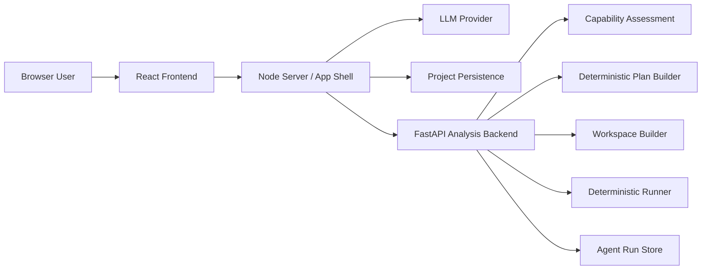
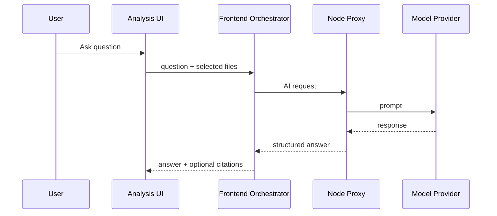
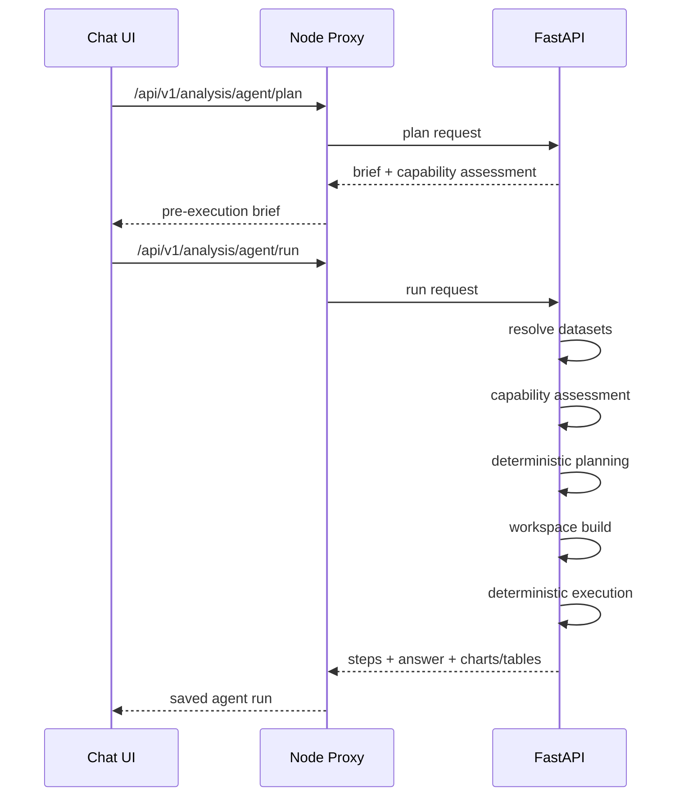

# Evidence CoPilot

Evidence CoPilot is a clinical analytics workspace for ingesting study files, standardizing data, exploring questions in chat, running deterministic analyses, and exporting reviewable results.

This is not a pure LLM chatbot. The product is intentionally split:
- `React + TypeScript` provides the UI and orchestration layer
- `Node` serves the app, persists projects, proxies requests, and starts the local stack
- `FastAPI + Python` performs capability checks, workspace building, and deterministic analysis execution

Core principle:

> The model can interpret, recommend, and explain.  
> Deterministic code selects data, derives endpoints, runs analyses, and returns auditable outputs.

## What The App Does

The product supports a realistic clinical workflow:

1. Upload raw datasets and study documents.
2. Run QC and optional cleaning.
3. Generate or review mapping specifications.
4. Standardize source data through ETL.
5. Ask exploratory or execution-oriented questions in AI Chat.
6. Run guided workflows in Autopilot or controlled reruns in Statistical Analysis.
7. Save executed runs, inspect provenance, and export HTML or notebook-style outputs.

Main user surfaces:
- `AI Insights Chat`: question-driven exploration and agent execution
- `AI Autopilot`: guided first-pass or batch-style execution
- `Statistical Analysis`: workbench for explicit review and reruns
- `ETL Pipeline`: data preparation
- `Bias Audit`: standalone bias/fairness-style review utility

## Current Product Model

The most important shift in the current codebase is that AI Chat is no longer just retrieval plus prose. It now has an agent execution path backed by FastAPI.

At a high level:
- `AI Chat` is the primary question interface
- `AI Analysis Agent` is the deterministic execution mode inside chat
- `Autopilot` still exists for guided multi-step or saved-run workflows
- `Statistical Analysis` remains the controlled workbench

The practical user model is:
- `AI Chat` = ask and explore
- `AI Analysis Agent` = execute a grounded multi-step analysis from chat
- `Autopilot` = guided or batched first pass
- `Statistical Analysis` = explicit review and controlled rerun
- `ETL` = prepare raw data so the rest of the product works reliably

## How Multi-Agent Chat Works

The current “multi-agent chat” is not a swarm of independent LLM agents. It is a structured analysis agent pipeline that combines:
- dataset resolution
- deterministic capability assessment
- deterministic planning
- workspace building
- deterministic execution
- supporting inspection steps
- structured interpretation

The main frontend entry point is [components/Analysis.tsx](/Users/mikhailnikonorov/Study-Data-analysis/components/Analysis.tsx).

The main backend execution layer is [backend/app/services/analysis_agent_service.py](/Users/mikhailnikonorov/Study-Data-analysis/backend/app/services/analysis_agent_service.py).

### End User Flow

When a user asks a question in AI Chat:

1. The chat resolves the currently selected sources and available project datasets.
2. The UI can auto-route the question into agent execution when it detects that the request needs real row-level analysis.
3. The backend performs a capability assessment before it tries to run anything.
4. If the question is feasible, the backend builds a deterministic plan.
5. The backend builds an analysis workspace from the selected datasets.
6. The deterministic runner executes the supported analysis family.
7. The agent optionally adds supplemental inspection steps such as supporting event profiles.
8. The system returns:
   - an answer
   - structured user summary
   - metrics
   - tables
   - charts
   - execution provenance
   - saved run metadata
9. The run can be reopened and exported as HTML or notebook-style content.

### Why It Is Called “Agent”

It is agent-like because it does more than answer from prompt context:
- it resolves datasets
- it evaluates whether the question is executable
- it plans the deterministic family
- it builds a new workspace
- it executes code-backed analysis
- it returns step history and provenance

It is not just “chat over summaries.”

### Capability Assessment

Before execution, the backend returns a structured capability assessment. This is one of the key recent additions.

The assessment answers:
- is this supported now?
- if not, is the blocker file selection, data readiness, planning, or method support?
- what roles or inputs are missing?
- what should the user do next?
- what fallback path is still valid?

Relevant contracts are defined in [backend/app/models/analysis.py](/Users/mikhailnikonorov/Study-Data-analysis/backend/app/models/analysis.py) and exposed through [services/fastapiAnalysisService.ts](/Users/mikhailnikonorov/Study-Data-analysis/services/fastapiAnalysisService.ts).

### Agent API Surface

The current FastAPI agent endpoints are in [backend/app/api/routes/analysis.py](/Users/mikhailnikonorov/Study-Data-analysis/backend/app/api/routes/analysis.py):

- `POST /analysis/capabilities`
- `POST /analysis/plan`
- `POST /analysis/build-workspace`
- `POST /analysis/run`
- `POST /analysis/agent/plan`
- `POST /analysis/agent/run`
- `GET /analysis/agent/runs`
- `GET /analysis/agent/run/{run_id}`
- `GET /analysis/agent/run/{run_id}/export/{export_format}`

### Agent Plan vs Agent Run

The chat uses two distinct agent operations:

- `agent plan`
  - returns a preview before execution
  - includes the proposed family, required roles, constraints, and support status
  - powers the “pre-execution brief” in chat

- `agent run`
  - actually executes the deterministic workflow
  - saves run history
  - returns steps, charts, tables, answer text, and structured interpretation

### What The Agent Actually Saves

Each executed agent run stores:
- question
- selected sources
- selected roles
- deterministic family
- execution status
- step trace
- answer
- user summary
- warnings
- optional chart/table payload

The run repository is implemented in [backend/app/services/analysis_agent_repository.py](/Users/mikhailnikonorov/Study-Data-analysis/backend/app/services/analysis_agent_repository.py).

### Why This Matters

The architecture gives you something a normal chat interface cannot:
- grounded failure modes
- explicit unsupported-method detection
- reproducible analysis outputs
- auditable provenance
- rerunnable saved runs

This is the main reason the AI Chat surface is now the product center of gravity.

## System Architecture



### Why It Is Split This Way

- The frontend owns UX, workflow state, charts, and saved-session interaction.
- Node owns local app concerns, persistence, and proxying.
- FastAPI owns the trusted execution path for row-level analytics.

## Request Lifecycles

### 1. AI Chat Summary Mode

Use this when the question can be answered from selected documents or dataset summaries.



### 2. AI Analysis Agent Mode

Use this when the question requires real execution.



### 3. Statistical Analysis Workbench

Use this when the user wants direct workbench control, preview analysis plans, review code-like outputs, or rerun with tighter oversight.

### 4. Autopilot

Use this when the user wants a guided or bundled workflow:
- quality check
- optional cleaning
- mapping and transform steps
- linked workspace creation
- one-question or analysis-pack execution
- saved grouped runs

## Deterministic Backend Responsibilities

The backend is not a generic model wrapper. Its job is to produce real analytical outputs.

Primary responsibilities:
- capability classification
- unsupported-method detection
- role inference
- deterministic plan construction
- endpoint template resolution
- cohort filtering
- workspace derivation
- analysis execution
- execution receipts
- saved agent run persistence

Core files:
- [backend/app/services/analysis_service.py](/Users/mikhailnikonorov/Study-Data-analysis/backend/app/services/analysis_service.py)
- [backend/app/services/workspace_builder.py](/Users/mikhailnikonorov/Study-Data-analysis/backend/app/services/workspace_builder.py)
- [backend/app/services/deterministic_runner.py](/Users/mikhailnikonorov/Study-Data-analysis/backend/app/services/deterministic_runner.py)
- [backend/app/services/analysis_agent_service.py](/Users/mikhailnikonorov/Study-Data-analysis/backend/app/services/analysis_agent_service.py)
- [backend/app/services/endpoint_templates.py](/Users/mikhailnikonorov/Study-Data-analysis/backend/app/services/endpoint_templates.py)

## Supported Deterministic Analysis Families

The current backend can route into these families:
- `incidence`
- `risk_difference`
- `logistic_regression`
- `kaplan_meier`
- `cox`
- `mixed_model`
- `threshold_search`
- `competing_risks`
- `feature_importance`
- `partial_dependence`

These are typed in [backend/app/models/analysis.py](/Users/mikhailnikonorov/Study-Data-analysis/backend/app/models/analysis.py).

## What The Capability Layer Now Detects

The backend now distinguishes between:
- `selection` blockers
  - duplicate singleton dataset roles
- `data` blockers
  - missing ADSL / ADAE / ADLB / ADTTE / DS / exposure inputs
- `planner` blockers
  - question could not be mapped to a supported family
- `method` blockers
  - question maps to a method the engine does not implement yet

Examples of explicit method gaps now called out directly:
- non-inferiority / equivalence testing
- multiplicity / gatekeeping
- causal inference / propensity workflows
- time-varying or recurrent-event survival methods
- Fine-Gray regression
- specialized safety workflows like Hy's law or lab shift tables

## Frontend Architecture

Important frontend files:
- [App.tsx](/Users/mikhailnikonorov/Study-Data-analysis/App.tsx)
- [components/Analysis.tsx](/Users/mikhailnikonorov/Study-Data-analysis/components/Analysis.tsx)
- [components/Autopilot.tsx](/Users/mikhailnikonorov/Study-Data-analysis/components/Autopilot.tsx)
- [components/Statistics.tsx](/Users/mikhailnikonorov/Study-Data-analysis/components/Statistics.tsx)
- [types.ts](/Users/mikhailnikonorov/Study-Data-analysis/types.ts)

Important frontend services:
- [services/geminiService.ts](/Users/mikhailnikonorov/Study-Data-analysis/services/geminiService.ts)
- [services/fastapiAnalysisService.ts](/Users/mikhailnikonorov/Study-Data-analysis/services/fastapiAnalysisService.ts)
- [services/executionBridge.ts](/Users/mikhailnikonorov/Study-Data-analysis/services/executionBridge.ts)
- [services/planningAssistService.ts](/Users/mikhailnikonorov/Study-Data-analysis/services/planningAssistService.ts)
- [services/commentaryService.ts](/Users/mikhailnikonorov/Study-Data-analysis/services/commentaryService.ts)

### Frontend Intelligence Model

The UI uses a hybrid model:

1. deterministic file and role recommendation
2. optional LLM planning assist
3. capability assessment before execution
4. deterministic execution when supported
5. structured AI explanation on top of executed results

This is why the app can say:
- what data is missing
- whether a question is supported
- why execution stopped
- what to do next
- and still avoid fabricating unsupported outputs

## Project Persistence

The Node layer persists:
- project metadata
- uploaded files
- mapping specs
- provenance records
- statistical sessions
- Autopilot runs

The FastAPI layer separately persists:
- temporary workspaces
- saved agent runs

## Repository Structure

Top-level directories:
- `backend/`
- `components/`
- `services/`
- `server/`
- `utils/`
- `public/`
- `docs/`

Backend highlights:
- `backend/app/`
- `backend/tests/`
- `backend/scripts/`

Node highlights:
- `server/index.js`
- `server/dev.js`
- `server/projectStore.js`
- `server/parse_sas.py`

## Local Development

Install dependencies:

```bash
npm install
python3 -m venv .venv
./.venv/bin/python -m pip install -r requirements.txt
```

Run the full local stack:

```bash
npm run dev
```

That starts:
- the Node server
- the Vite-powered frontend path
- the FastAPI backend on port `8000`

Useful scripts:

```bash
npm run dev
npm run build
npm run test
npm run api:test
npm run api:watch
npm run start
```

## Testing And Validation

Useful validation commands:

```bash
npm run build
npm run test
python3 -m compileall backend/app
./.venv/bin/python -m unittest discover -s backend/tests
```

## Current Limits

Important current limits of the system:
- the agent is deterministic, not a general autonomous notebook runner
- unsupported methods are intentionally blocked instead of approximated
- some clinical question classes still require more domain-specific derivation logic
- advanced survival, causal inference, and specialized safety tables are not fully implemented
- the app is strongest when the underlying roles can be resolved into clean analysis-ready domains

## Why The Architecture Is Strong

This repository has three practical strengths:

1. It does not rely on the LLM to invent analytical results.
2. It now exposes explicit support boundaries before execution.
3. It gives the user one question-driven interface that can still produce grounded, reviewable analysis artifacts.

That combination is the main value of the current codebase.
