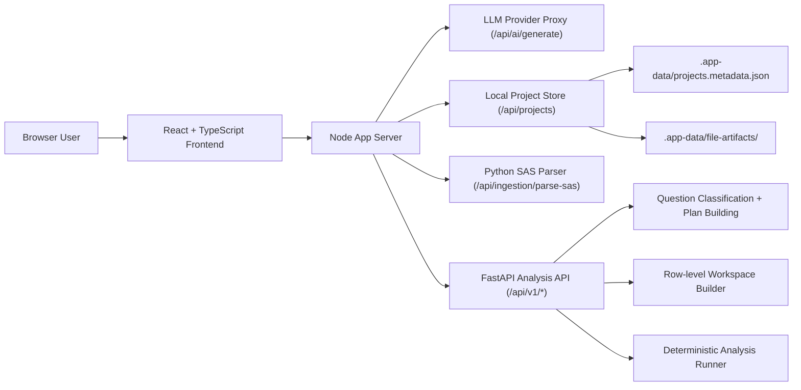
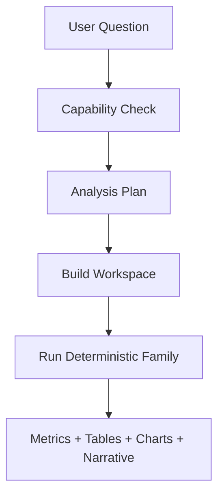

# Evidence CoPilot

Evidence CoPilot is a clinical analytics workspace for ingestion, QC, mapping, linked dataset analysis, AI-assisted reasoning, deterministic statistical execution, and exportable reports.

This repository currently contains a hybrid architecture:
- a React + TypeScript frontend
- a Node server that serves the app, proxies AI calls, persists local project state, and proxies advanced analysis requests
- a FastAPI backend that performs row-level workspace building and deterministic clinical/statistical execution

The product is beyond a simple UI prototype. It now supports real backend execution for a growing set of analysis families, while still using AI for planning, explanation, RAG-style retrieval, and user assistance.

## Table of Contents

- [What The App Does](#what-the-app-does)
- [Architecture Overview](#architecture-overview)
- [Frontend Architecture](#frontend-architecture)
- [Backend Architecture](#backend-architecture)
- [Analysis Execution Model](#analysis-execution-model)
- [Repository Structure](#repository-structure)
- [Supported Analysis Types](#supported-analysis-types)
- [Local Development](#local-development)
- [Environment Variables](#environment-variables)
- [Testing And Validation](#testing-and-validation)
- [Current Strengths And Limits](#current-strengths-and-limits)
- [Deployment Model In This Repo](#deployment-model-in-this-repo)

## What The App Does

Evidence CoPilot is designed around a clinical data workflow:

1. Ingest source datasets and documents.
2. Run quality checks and identify issues.
3. Generate or review mapping logic.
4. Standardize datasets and build linked analysis workspaces.
5. Ask questions in AI Chat or run structured analyses in Statistical Analysis / Autopilot.
6. Produce tables, charts, narrative interpretation, provenance, and HTML exports.

The app supports several product surfaces:
- `Ingestion & QC`
- `Mapping Specs`
- `ETL Pipeline`
- `AI Insights Chat`
- `AI Autopilot`
- `Statistical Analysis`
- `Bias Audit`
- `Provenance Log`

## Architecture Overview

The codebase now has three major layers.



### Why the architecture is split this way

- The frontend owns user interaction, view state, charts, and workbench UX.
- The Node server remains the local application shell and backend boundary for persistence, AI proxying, and local dev orchestration.
- FastAPI handles heavier clinical/statistical logic because Python is the right execution environment for row-level derivation, survival methods, regression, and validation workflows.

### High-level request paths

1. `General AI question`
   - frontend -> Node AI proxy -> model provider

2. `Project save/load`
   - frontend -> Node `/api/projects` -> local metadata + artifact storage

3. `SAS ingestion`
   - frontend -> Node `/api/ingestion/parse-sas` -> Python `pyreadstat`

4. `Advanced deterministic analysis`
   - frontend -> Node proxy `/api/v1/*` -> FastAPI -> workspace builder + deterministic runner

## Frontend Architecture

The frontend is a React 19 + TypeScript Vite application.

Primary entry points:
- [App.tsx](/Users/mikhailnikonorov/Clinical-trial-insight/App.tsx): top-level shell, routing-by-view, project lifecycle, persistence initialization
- [types.ts](/Users/mikhailnikonorov/Clinical-trial-insight/types.ts): shared application types
- [components](/Users/mikhailnikonorov/Clinical-trial-insight/components): main feature surfaces
- [services](/Users/mikhailnikonorov/Clinical-trial-insight/services): frontend service layer
- [utils](/Users/mikhailnikonorov/Clinical-trial-insight/utils): deterministic helpers, retrieval, project helpers, dataset profiling

### Frontend responsibilities

- workspace and project selection
- file upload and file browsing
- QC issue display and remediation UI
- mapping review and transformation workflow
- AI Chat interaction and retrieved-source display
- Statistical Analysis workbench
- Autopilot execution and saved-run workspace
- chart rendering and HTML export
- client-side orchestration of backend requests

### Important frontend modules

- [components/Analysis.tsx](/Users/mikhailnikonorov/Clinical-trial-insight/components/Analysis.tsx)
  - AI Chat UI
  - source selection and RAG mode
  - user-facing display of retrieved sources and analytical responses

- [components/Statistics.tsx](/Users/mikhailnikonorov/Clinical-trial-insight/components/Statistics.tsx)
  - structured analysis workbench
  - endpoint builder
  - dataset selection
  - advanced analysis plan preview
  - deterministic execution handoff

- [components/Autopilot.tsx](/Users/mikhailnikonorov/Clinical-trial-insight/components/Autopilot.tsx)
  - exploratory and confirmed run setup
  - saved-run browser
  - execution log/workflow review
  - result workspace

- [services/geminiService.ts](/Users/mikhailnikonorov/Clinical-trial-insight/services/geminiService.ts)
  - central orchestration layer for AI Chat and several analysis flows
  - decides whether to use:
    - LLM explanation path
    - local deterministic path
    - FastAPI deterministic path
  - contains guardrails to prevent fabricated advanced analyses

- [services/fastapiAnalysisService.ts](/Users/mikhailnikonorov/Clinical-trial-insight/services/fastapiAnalysisService.ts)
  - typed client for FastAPI analysis endpoints

- [utils/rag.ts](/Users/mikhailnikonorov/Clinical-trial-insight/utils/rag.ts)
  - query-aware retrieval over selected documents and tabular chunks

- [utils/statisticsEngine.ts](/Users/mikhailnikonorov/Clinical-trial-insight/utils/statisticsEngine.ts)
  - legacy/local deterministic engine for simpler single-dataset execution

## Backend Architecture

There are two backend layers in this repository.

### 1. Node application server

Main file:
- [server/index.js](/Users/mikhailnikonorov/Clinical-trial-insight/server/index.js)

Responsibilities:
- serve the Vite app in development and the built app in production mode
- proxy LLM requests through `/api/ai/generate`
- persist projects via `/api/projects`
- parse SAS datasets via `/api/ingestion/parse-sas`
- proxy `/api/v1/*` requests to FastAPI

Supporting files:
- [server/dev.js](/Users/mikhailnikonorov/Clinical-trial-insight/server/dev.js): unified local dev launcher
- [server/projectStore.js](/Users/mikhailnikonorov/Clinical-trial-insight/server/projectStore.js): local metadata/artifact persistence
- [server/parse_sas.py](/Users/mikhailnikonorov/Clinical-trial-insight/server/parse_sas.py): server-side SAS parsing helper

### 2. FastAPI analysis backend

Main app:
- [backend/app/main.py](/Users/mikhailnikonorov/Clinical-trial-insight/backend/app/main.py)

API routes:
- [backend/app/api/routes/health.py](/Users/mikhailnikonorov/Clinical-trial-insight/backend/app/api/routes/health.py)
- [backend/app/api/routes/analysis.py](/Users/mikhailnikonorov/Clinical-trial-insight/backend/app/api/routes/analysis.py)

Core services:
- [backend/app/services/analysis_service.py](/Users/mikhailnikonorov/Clinical-trial-insight/backend/app/services/analysis_service.py)
  - question classification
  - capability checks
  - plan construction
  - workspace lifecycle
  - deterministic family dispatch

- [backend/app/services/workspace_builder.py](/Users/mikhailnikonorov/Clinical-trial-insight/backend/app/services/workspace_builder.py)
  - dataset role inference
  - row-level subject/event workspace construction
  - derived endpoint preparation
  - cohort filtering
  - multi-domain feature assembly

- [backend/app/services/deterministic_runner.py](/Users/mikhailnikonorov/Clinical-trial-insight/backend/app/services/deterministic_runner.py)
  - deterministic statistical and ML-family execution

- [backend/app/services/endpoint_templates.py](/Users/mikhailnikonorov/Clinical-trial-insight/backend/app/services/endpoint_templates.py)
  - reusable endpoint templates for common question shapes

Models and contracts:
- [backend/app/models/analysis.py](/Users/mikhailnikonorov/Clinical-trial-insight/backend/app/models/analysis.py)

### FastAPI endpoint contract

Current analysis API surface:
- `POST /api/v1/analysis/capabilities`
- `POST /api/v1/analysis/plan`
- `POST /api/v1/analysis/build-workspace`
- `POST /api/v1/analysis/run`

This split matters because the app can:
- first decide whether a question is executable
- then build a structured analysis plan
- then build a row-level workspace
- then execute a deterministic analysis family

That is the main safety mechanism that prevents the app from inventing complex outputs from chat summaries alone.

## Analysis Execution Model

The app is intentionally hybrid, not purely LLM-driven.

### Path 1: LLM assistance

Used for:
- general help
- dataset understanding
- document Q&A
- RAG-style retrieval answers
- methodology explanation
- user-facing interpretation

### Path 2: local deterministic execution

Used for:
- some simpler single-dataset analyses
- lightweight statistical workflows that do not need the row-level FastAPI workspace

### Path 3: FastAPI deterministic execution

Used for:
- multi-dataset row-level joins
- advanced endpoint derivations
- survival workflows
- multivariable models
- exploratory ML outputs
- reusable endpoint templates

### Execution flow for advanced analyses



### Why some answers are very fast

Some advanced answers return quickly because:
- the question is routed directly to deterministic code
- the datasets are already small/in-memory
- the response is generated from computed metrics, not from a long-form LLM completion

Fast does not automatically mean fake. The safer signal is whether the answer explicitly reflects:
- executed cohort filters
- the applied treatment grouping
- the derived endpoint
- tables/metrics produced by the deterministic engine

## Repository Structure

Top-level structure:

- [App.tsx](/Users/mikhailnikonorov/Clinical-trial-insight/App.tsx): application shell
- [types.ts](/Users/mikhailnikonorov/Clinical-trial-insight/types.ts): shared app types
- [components](/Users/mikhailnikonorov/Clinical-trial-insight/components): UI feature surfaces
- [services](/Users/mikhailnikonorov/Clinical-trial-insight/services): frontend service/orchestration layer
- [utils](/Users/mikhailnikonorov/Clinical-trial-insight/utils): retrieval, dataset parsing helpers, deterministic client logic
- [server](/Users/mikhailnikonorov/Clinical-trial-insight/server): Node app server and local persistence layer
- [backend](/Users/mikhailnikonorov/Clinical-trial-insight/backend): FastAPI analysis backend
- [backend/tests](/Users/mikhailnikonorov/Clinical-trial-insight/backend/tests): Python backend tests and fixtures
- [docs](/Users/mikhailnikonorov/Clinical-trial-insight/docs): architecture notes, plans, and validation reports
- [public](/Users/mikhailnikonorov/Clinical-trial-insight/public): static assets

## Supported Analysis Types

The codebase now supports these analysis families through either the local engine or the FastAPI backend:

- incidence comparison
- risk difference
- logistic regression
- Kaplan-Meier
- Cox proportional hazards
- mixed model / repeated-measures style analysis
- threshold search / early-warning workflow
- competing risks / cumulative incidence summary
- feature importance
- partial dependence

More traditional local analysis support also exists for:
- t-test
- chi-square
- ANOVA
- linear regression
- correlation

### Important distinction

Not every natural-language question is universally supported just because a family exists.

Execution depends on:
- whether the selected datasets expose the required roles
- whether the needed columns can be inferred or mapped
- whether the endpoint can be derived from available data
- whether the requested question matches a supported workflow template

In other words: the app now supports many real families, but still within a bounded clinical-analytics execution model.

## Local Development

### Prerequisites

- Node.js 22.x recommended
- npm 10+
- Python 3.12+ recommended

### Install JavaScript dependencies

```bash
npm install
```

### Install Python dependencies

```bash
python3 -m venv .venv
./.venv/bin/python -m pip install -r requirements.txt
```

### Start the full local stack

```bash
npm run api:setup
npm run dev
```

This launches:
- the Node/Vite application shell on port `3000` by default
- the FastAPI backend on port `8000`

If `3000` is already in use:

```bash
PORT=3100 npm run dev
```

### Run only the FastAPI backend

```bash
npm run api:dev
```

### Run FastAPI with autoreload

```bash
npm run api:watch
```

### Build the frontend

```bash
npm run build
```

### Run the built app locally

```bash
npm run start
```

## Environment Variables

Typical local variables:

```bash
GEMINI_API_KEY=your_key_here
PORT=3000
ECP_ENV=development
VITE_FASTAPI_BASE_URL=http://localhost:8000/api/v1
```

Useful optional variables:

- `ECP_FASTAPI_URL`
  - Node proxy target for the FastAPI backend
- `ECP_PYTHON_BIN`
  - override Python binary used for SAS parsing

## Testing And Validation

### Frontend/unit tests

```bash
npm test
```

### Python backend tests

```bash
npm run api:test
```

### Generate backend reference validation report

```bash
npm run api:benchmark
```

Relevant validation assets:
- [backend/tests/test_reference_validation.py](/Users/mikhailnikonorov/Clinical-trial-insight/backend/tests/test_reference_validation.py)
- [docs/reference-validation-report.md](/Users/mikhailnikonorov/Clinical-trial-insight/docs/reference-validation-report.md)

## Current Strengths And Limits

### Strengths

- real deterministic backend execution exists for multiple advanced families
- the app has explicit capability/plan/workspace/run stages for safer execution
- AI Chat no longer has to fabricate advanced charts when deterministic execution is required
- project persistence is backend-backed instead of browser-only
- SAS ingestion is supported through a server-side Python path
- the UI now supports saved-run review in Autopilot and structured workbench analysis in Statistical Analysis

### Important limits

- question planning still relies heavily on heuristic classification and endpoint templates
- the frontend has several oversized orchestration files, especially:
  - [components/Autopilot.tsx](/Users/mikhailnikonorov/Clinical-trial-insight/components/Autopilot.tsx)
  - [components/Statistics.tsx](/Users/mikhailnikonorov/Clinical-trial-insight/components/Statistics.tsx)
  - [services/geminiService.ts](/Users/mikhailnikonorov/Clinical-trial-insight/services/geminiService.ts)
- backend workspace storage is currently in-memory inside the FastAPI service
- backend test depth is still lighter than ideal for the number of supported families
- this is a strong clinical analytics POC, not yet a fully general production-grade clinical platform

## Deployment Model In This Repo

This repository is optimized for:
- local development
- local pilot use
- single-user or small-team prototype workflows

It is not yet a full enterprise deployment package.

### What is already in place

- server-side AI boundary
- server-side persistence boundary
- Python backend for clinical/statistical execution
- report generation
- provenance-oriented workflow concepts

### What would still be needed for enterprise hardening

- real database-backed metadata storage
- object storage for artifacts
- authentication and authorization enforcement
- async job execution for heavier analyses
- persistent workspace storage
- stronger validation and governance workflows
- CI/CD and production observability

## Recommended Reading Inside The Repo

- [docs/react-fastapi-development-plan.md](/Users/mikhailnikonorov/Clinical-trial-insight/docs/react-fastapi-development-plan.md)
- [docs/reference-validation-report.md](/Users/mikhailnikonorov/Clinical-trial-insight/docs/reference-validation-report.md)
- [backend/app/services/analysis_service.py](/Users/mikhailnikonorov/Clinical-trial-insight/backend/app/services/analysis_service.py)
- [backend/app/services/workspace_builder.py](/Users/mikhailnikonorov/Clinical-trial-insight/backend/app/services/workspace_builder.py)
- [backend/app/services/deterministic_runner.py](/Users/mikhailnikonorov/Clinical-trial-insight/backend/app/services/deterministic_runner.py)
- [services/geminiService.ts](/Users/mikhailnikonorov/Clinical-trial-insight/services/geminiService.ts)
- [components/Statistics.tsx](/Users/mikhailnikonorov/Clinical-trial-insight/components/Statistics.tsx)
- [components/Autopilot.tsx](/Users/mikhailnikonorov/Clinical-trial-insight/components/Autopilot.tsx)

## Summary

This repo is best understood as a hybrid clinical analytics application:
- React/TypeScript for user experience
- Node for app-shell serving, persistence, AI proxying, and local orchestration
- FastAPI/Python for row-level workspace construction and deterministic clinical/statistical execution

That split is the key architectural decision in the current codebase, and it explains how the app can combine:
- AI chat and retrieval
- deterministic analysis
- multi-dataset clinical derivations
- exportable analytical outputs

If you are onboarding to the codebase, start with:
1. [App.tsx](/Users/mikhailnikonorov/Clinical-trial-insight/App.tsx)
2. [components/Analysis.tsx](/Users/mikhailnikonorov/Clinical-trial-insight/components/Analysis.tsx)
3. [components/Statistics.tsx](/Users/mikhailnikonorov/Clinical-trial-insight/components/Statistics.tsx)
4. [components/Autopilot.tsx](/Users/mikhailnikonorov/Clinical-trial-insight/components/Autopilot.tsx)
5. [server/index.js](/Users/mikhailnikonorov/Clinical-trial-insight/server/index.js)
6. [backend/app/main.py](/Users/mikhailnikonorov/Clinical-trial-insight/backend/app/main.py)
7. [backend/app/services/analysis_service.py](/Users/mikhailnikonorov/Clinical-trial-insight/backend/app/services/analysis_service.py)
