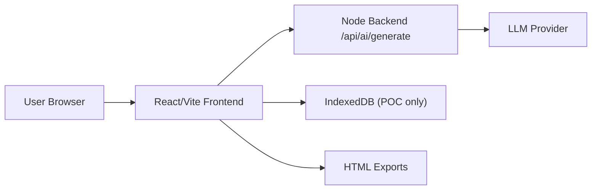
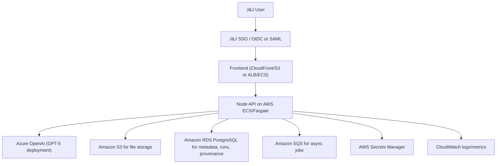

# Evidence CoPilot

Evidence CoPilot is a clinical and real-world evidence analytics workspace for:
- data ingestion and QC
- AI-assisted mapping and standardization
- exploratory and controlled statistical analysis
- protocol/SAP-assisted analysis planning
- linked multi-dataset analysis
- provenance and exportable reports

This repository contains the current prototype application and the minimum backend required to run AI features securely through a server-side proxy.

## What This Repository Includes

- React + Vite frontend
- Integrated Node server for local development and simple deployment
- Server-side AI proxy endpoint at `/api/ai/generate`
- Deterministic statistical execution engine in the app
- Browser-based project persistence for POC use via IndexedDB
- Evidence CoPilot branding and report export

## Current Architecture



Current implementation notes:
- The frontend calls the backend for AI interactions.
- The backend currently uses Google Gemini in `server/index.js`.
- Deterministic statistics are executed locally in app logic, not by the model.
- Project state is stored in browser IndexedDB for prototype testing.

## Repository Structure

- `/components` UI modules
- `/services/geminiService.ts` frontend service layer for AI and deterministic workflows
- `/server/index.js` integrated backend server and AI proxy
- `/utils/statisticsEngine.ts` deterministic analysis execution
- `/utils/projectStorage.ts` browser persistence
- `/public` static assets including the Evidence CoPilot logo

## Local Reproduction

### Prerequisites

- Node.js 22.x recommended
- npm 10+

### Install

```bash
npm install
```

### Local environment

Create `.env.local` in the repository root.

For the current prototype backend:

```bash
GEMINI_API_KEY=your_key_here
PORT=3000
```

### Run locally

```bash
npm run dev
```

Open:

```text
http://localhost:3000
```

### Production-style local run

```bash
npm run build
npm run start
```

## What Is Reproducible From Git

A colleague can reproduce:
- the application code
- UI behavior
- AI proxy pattern
- deterministic analytics behavior
- export/report generation

A colleague cannot reproduce automatically:
- your browser-stored projects
- uploaded source files
- local `.env.local`
- your saved chat history and runs

For shared testing, import the same datasets and recreate the same environment variables.

## POC vs Enterprise

### Current POC assumptions

The current codebase is suitable for pilot testing, not regulated production.

POC characteristics:
- everyone has full access in the app
- auth is intentionally simplified
- project data is stored in the browser
- some frontend dependencies are loaded from CDN in `index.html`
- the backend is a lightweight integrated Node server

### Enterprise target state

For enterprise deployment, the recommended target architecture is:



## Enterprise Deployment Recommendation

### Frontend

Recommended options:
- `S3 + CloudFront` if serving a static build only
- `AWS ECS/Fargate + ALB` if you want the frontend and backend served together from one service

Recommendation for this repo:
- keep the frontend as a static React build
- move the current integrated backend into a dedicated API service
- avoid depending on browser persistence for enterprise use

### Backend

Recommended runtime:
- Node.js service on AWS ECS/Fargate
- private subnets for compute where possible
- public ingress only through ALB or approved API gateway pattern

Move the following server-side for enterprise use:
- AI calls
- file parsing where PHI/PII sensitivity requires central control
- project persistence
- report generation if you need governed exports
- provenance/audit persistence

### Data persistence

Replace browser IndexedDB with managed backend persistence:
- `S3` for uploaded raw files, standardized files, generated exports
- `RDS PostgreSQL` for:
  - projects
  - file metadata
  - mapping specs
  - analysis runs
  - review decisions
  - provenance/audit logs
- optional `Redis/ElastiCache` if you later need short-lived job/session caching

### Async processing

Use async job execution for heavier operations:
- workbook import
- multi-file linking
- Autopilot packs
- large exports
- protocol/SAP extraction on large documents

Recommended pattern:
- API submits job
- `SQS` queue stores work
- worker service processes job
- status stored in `RDS`
- artifacts stored in `S3`

## Azure OpenAI With GPT-5

### Why this is the right integration boundary

The frontend already talks to a single backend endpoint:
- `/api/ai/generate`

That means changing LLM provider should be done in the backend only.
The frontend contract can remain stable.

### Recommended provider strategy

Refactor the backend into an AI provider abstraction:
- `geminiProvider`
- `azureOpenAIProvider`

The frontend should continue calling:
- `/api/ai/generate`

This is the cleanest enterprise pattern because:
- no model credentials reach the browser
- provider changes do not require frontend rewrites
- provider choice can be environment-driven

### Azure OpenAI guidance

For Azure OpenAI, use GPT-5 through the Responses API from the backend.

Based on current Microsoft documentation:
- Azure OpenAI Responses API is the recommended path for latest features
- not every model is available in every Azure region
- the `model` field must match your Azure deployment name
- Microsoft Entra ID is supported and preferred for enterprise auth to the Azure resource

### Recommended Azure environment variables

```bash
AI_PROVIDER=azure-openai
OPENAI_BASE_URL=https://YOUR-RESOURCE-NAME.openai.azure.com/openai/v1/
OPENAI_API_KEY=your_azure_openai_key
AZURE_OPENAI_DEPLOYMENT=gpt-5
AZURE_OPENAI_USE_ENTRA=false
PORT=3000
```

Preferred enterprise auth variant:
- avoid long-lived API keys where possible
- use Microsoft Entra ID / managed identity from AWS workload if your enterprise networking and identity model allows it

### Recommended backend change for Azure OpenAI

Current file to replace/refactor:
- `server/index.js`

Current provider-specific dependency:
- `@google/genai`

Recommended enterprise dependency:

```bash
npm install openai
```

Recommended backend pattern:

```ts
import OpenAI from 'openai';

const client = new OpenAI({
  baseURL: process.env.OPENAI_BASE_URL,
  apiKey: process.env.OPENAI_API_KEY,
});

const response = await client.responses.create({
  model: process.env.AZURE_OPENAI_DEPLOYMENT,
  input: prompt,
});
```

Important implementation note:
- in Azure OpenAI, `model` should be the Azure deployment name, not just a generic model family label

### Recommended model choices

For this app, a sensible enterprise split is:
- `gpt-5` for protocol/SAP extraction, planning, and higher-value commentary
- `gpt-5-mini` for lower-cost chat/QC/mapping suggestion tasks if quality is acceptable

Use one provider config per task class rather than one model for everything.

## J&J Authorization / Enterprise Sign-In

Current state:
- role-based access is intentionally disabled for POC testing
- the app currently shows `POC Access`
- access logic is centralized in `utils/accessControl.ts`

Recommended enterprise state:
- authenticate users with J&J corporate identity
- authorize on the backend using enterprise claims/groups
- stop treating frontend access flags as authoritative

Recommended auth model:
- J&J IdP via `OIDC` or `SAML`
- backend validates identity/session or JWT claims
- frontend receives only the user profile and permitted capabilities

Recommended implementation pattern:
1. Add enterprise login at the edge or in the backend
2. Pass validated user identity to the app
3. Re-enable access control using claims/groups from the identity provider
4. Enforce permissions in backend APIs, not just in frontend navigation

Do not rely on:
- local role pickers
- browser-side authorization alone

## Security Requirements For Enterprise Use

Before enterprise rollout, the following should be treated as required:

1. Remove browser-only project persistence for governed data
2. Store files and runs on managed backend infrastructure
3. Keep all LLM credentials server-side only
4. Use Secrets Manager for secrets
5. Add immutable run manifests and artifact hashes
6. Add server-side audit logging
7. Restrict report exports by user identity and project entitlement
8. Replace CDN-loaded frontend dependencies with bundled or approved internal asset hosting
9. Add data retention and deletion policies
10. Classify outputs as exploratory vs confirmed in stored metadata

## Gaps To Close Before Enterprise Deployment

This repo is a strong prototype, but the following are still recommended before production:

- move project/session persistence out of IndexedDB
- move large-file processing and multi-file jobs fully server-side
- add durable audit trail in database
- add approval workflow for AI-assisted mapping and confirmatory runs
- add claim-based authorization enforced by backend
- remove or replace CDN dependencies in `index.html`
- add CI/CD, containerization, infrastructure-as-code, and environment promotion
- add structured health checks and observability dashboards

## Suggested AWS Deployment Topology

### Minimum viable enterprise topology

- CloudFront
- S3 for static frontend
- ALB
- ECS/Fargate service for Node API
- RDS PostgreSQL
- S3 document/file bucket
- Secrets Manager
- CloudWatch

### Scaled topology

- CloudFront
- WAF
- ALB
- ECS/Fargate API service
- ECS/Fargate worker service
- SQS
- RDS PostgreSQL
- S3 raw bucket
- S3 curated/standardized bucket
- KMS encryption
- Secrets Manager
- CloudWatch + alarms

## CI/CD Recommendation

At minimum:
- lint/test/build on pull request
- build immutable container image for backend
- build static frontend artifact
- deploy by environment: dev, test, prod
- separate Azure OpenAI resource/deployment config by environment

## Observability Recommendation

At minimum, emit and monitor:
- API request count and latency
- AI provider failures
- file ingestion failures
- QC pass/fail counts
- mapping approval counts
- Autopilot execution failures
- export generation failures
- user/session audit events

## Enterprise Rebuild Checklist

Use this checklist when recreating the app in J&J infrastructure:

- [ ] Clone repo
- [ ] Install dependencies
- [ ] Decide whether frontend and backend deploy together or separately
- [ ] Replace browser-only persistence with backend persistence
- [ ] Implement J&J SSO
- [ ] Enforce authorization on backend APIs
- [ ] Swap Gemini backend provider to Azure OpenAI provider
- [ ] Configure Azure GPT-5 deployment and region
- [ ] Store secrets in AWS Secrets Manager
- [ ] Move file storage to S3
- [ ] Move project/run metadata to RDS
- [ ] Add async processing for heavy jobs
- [ ] Add audit logging and immutable run manifests
- [ ] Remove or vendor CDN frontend dependencies
- [ ] Add environment-specific CI/CD and observability

## References

- OpenAI GPT-5 model docs: https://developers.openai.com/api/docs/models/gpt-5
- Azure OpenAI Responses API docs: https://learn.microsoft.com/en-us/azure/ai-foundry/openai/how-to/responses
- Azure OpenAI v1 API guidance: https://learn.microsoft.com/en-us/azure/ai-foundry/foundry-models/how-to/use-chat-completions

## Current Commands

```bash
npm install
npm run dev
npm run test
npm run build
npm run start
```

## Notes For the Next Engineering Team

The cleanest enterprise migration path is:
1. keep the frontend contract stable
2. move persistence and jobs server-side
3. swap only the backend AI provider first
4. integrate enterprise auth second
5. harden audit/provenance third

That sequence preserves momentum and avoids rewriting the whole app at once.
