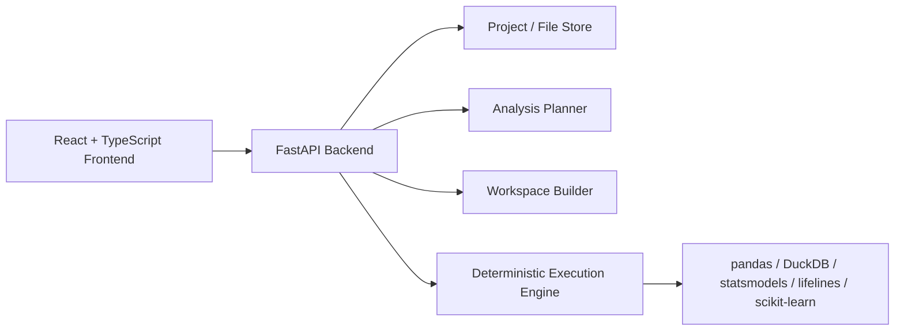

# React + FastAPI Development Plan

## Goal

Migrate the application from a React + integrated Node prototype into:

- React + TypeScript frontend for the user experience
- FastAPI analysis backend for clinical analysis planning, workspace construction, and deterministic execution
- Python analytics modules for row-level joins, endpoint derivations, and advanced statistical models
- Node retained only where still useful during transition for local persistence and legacy proxy behavior

## Why This Architecture

The current frontend is already a strong fit for React + TypeScript:

- the UI is React-based
- state is heavily structured
- analysis, provenance, project, and export payloads benefit from static typing

The backend direction should move toward FastAPI because:

- the advanced execution layer is naturally Python-centric
- row-level clinical data processing is better served by pandas, DuckDB, statsmodels, lifelines, and scikit-learn
- typed request and response contracts map well to Pydantic models
- the current Node backend is adequate for a prototype proxy, but it is not the best long-term home for clinical derivations and deterministic analytics

## Current Constraints In The Repository

1. AI Chat performs deterministic analysis only when exactly one tabular dataset is selected.
2. Multi-file analytical questions fall back to LLM-generated narrative over summaries instead of executed analysis.
3. The linked-workspace builder compresses supporting datasets into subject-level summary features, which destroys term-level and timing detail required for event-level questions.
4. Statistical execution ignores advanced controls such as covariates, imputation, and PSM during deterministic execution.

## Recommended Target Architecture

## Service Responsibilities

### React frontend

- project and file selection UX
- context and workflow selection
- displaying validated analysis plans, run status, tables, charts, and provenance
- preventing unsupported question types from silently falling back to invented charts

### FastAPI backend

- validate analysis requests
- classify supported vs unsupported analytical questions
- construct row-level analysis workspaces
- derive clinical endpoints deterministically
- execute statistical and exploratory models
- return explicit result metadata and limitations

### Legacy Node backend during transition

- local project persistence
- current AI proxy endpoint
- SAS ingestion endpoint until the equivalent path is moved or proxied

## Phased Implementation Plan

### Phase 0: Safety and routing controls

Scope:

- add a hard capability gate for analytical chat questions
- block invented charts for summary-only answers
- surface missing domain or row-level data explicitly

Deliverables:

- backend capability classification endpoint
- frontend analysis service wrapper for FastAPI
- clear UI states for supported, missing-input, and unsupported questions

### Phase 1: FastAPI backend foundation

Scope:

- introduce FastAPI package layout
- add typed request and response models
- add health and analysis endpoints
- add shared analysis result envelope and error schema

Deliverables:

- `backend/app/main.py`
- `backend/app/models/*`
- `backend/app/api/routes/*`
- `backend/app/services/*`

### Phase 2: Row-level analysis workspace

Scope:

- stop using subject-summary collapse for advanced workflows
- add role-aware dataset registration for ADSL, ADAE, ADLB, EX/ADEX, and optional disposition/compliance files
- build row-level workspaces via DuckDB and pandas

Deliverables:

- row-level workspace builder
- explicit workspace manifest with source datasets, join keys, and derivation notes
- missing-domain diagnostics

### Phase 3: Deterministic clinical derivations and models

Scope:

- implement endpoint derivations such as:
  - Grade >= 2 DAE by Week 12
  - time to first Grade >= 2 DAE
  - time to resolution
  - early dermatologic events in Weeks 1-4
  - later interruptions or discontinuations
- implement deterministic model families:
  - incidence with risk difference and confidence intervals
  - logistic regression
  - Kaplan-Meier
  - multivariable Cox

Deliverables:

- backend derivation library
- backend execution library
- typed analysis outputs with tables, metrics, and traceable assumptions

### Phase 4: Exploratory ML for hypothesis generation

Scope:

- implement exploratory-only tree-based models
- add SHAP or partial dependence outputs
- label exploratory outputs clearly

Deliverables:

- feature importance output
- partial dependence output
- explicit exploratory status in result metadata

### Phase 5: Frontend cutover

Scope:

- move analytical workflows from Node-centered service code to FastAPI-backed execution
- preserve the current project workflow while replacing execution internals

Deliverables:

- chat planning and execution boundary
- Statistical Analysis cutover
- Autopilot cutover for advanced question types

## Initial Backend Contracts

The first FastAPI contracts should cover:

- `GET /api/v1/health`
- `POST /api/v1/analysis/capabilities`
- `POST /api/v1/analysis/plan`
- `POST /api/v1/analysis/build-workspace`
- `POST /api/v1/analysis/run`

These endpoints should return typed payloads that distinguish:

- executable analyses
- analyses blocked by missing data domains
- unsupported requests

## Migration Rules

1. Do not let the frontend render analytical charts unless the backend marks the response as executed.
2. Keep current Node routes working during transition.
3. Route new analytical capability through FastAPI first.
4. Treat linked subject-summary analysis as exploratory-only and keep it separate from row-level execution.
5. Use the frontend TypeScript models as the contract reference, then align FastAPI Pydantic models to them.

## Implementation Order In This Repository

1. Add FastAPI backend scaffold and models.
2. Add frontend FastAPI client wrapper.
3. Add capability gating and unsupported-question handling.
4. Add row-level workspace builder.
5. Add deterministic execution modules.
6. Rewire chat, statistics, and Autopilot to the new backend.

## Acceptance Criteria

- No analytical response returns a chart without backend execution metadata.
- Multi-file analytical requests no longer rely on dataset-profile summaries alone.
- Term-level and timing data remain available for advanced questions.
- The frontend can call a typed FastAPI analysis boundary without breaking the current Node-powered project workflow.
